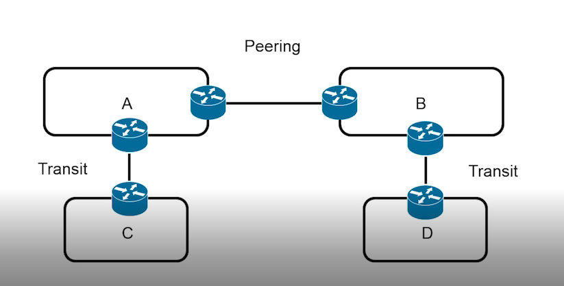
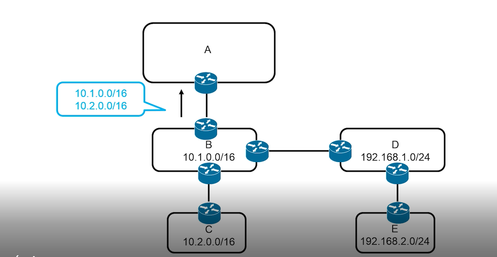
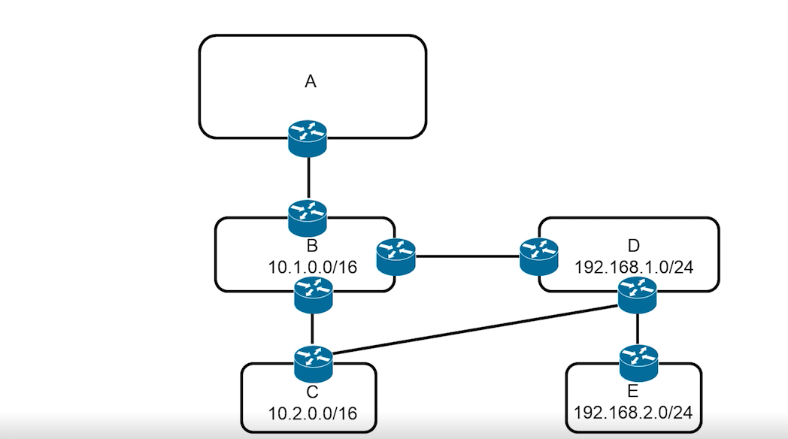
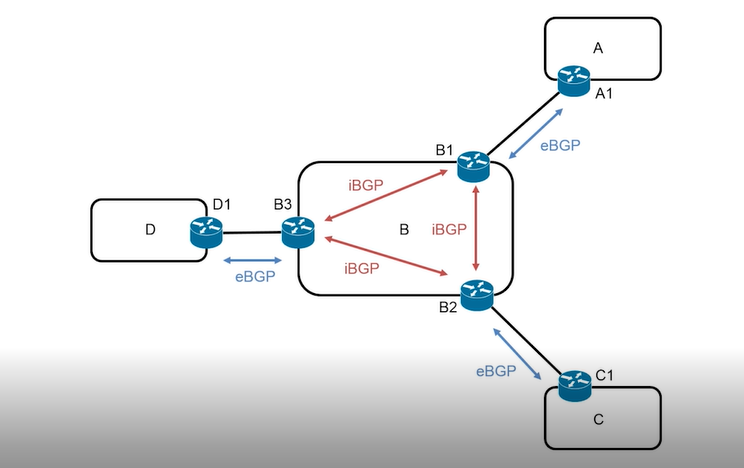
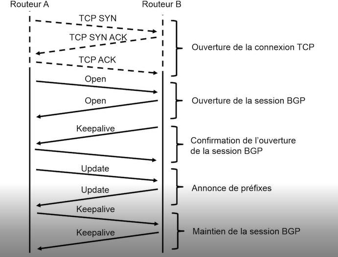
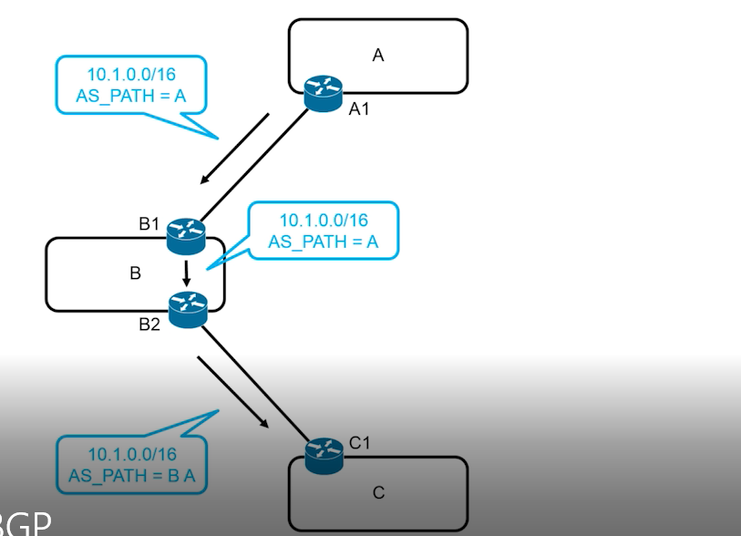
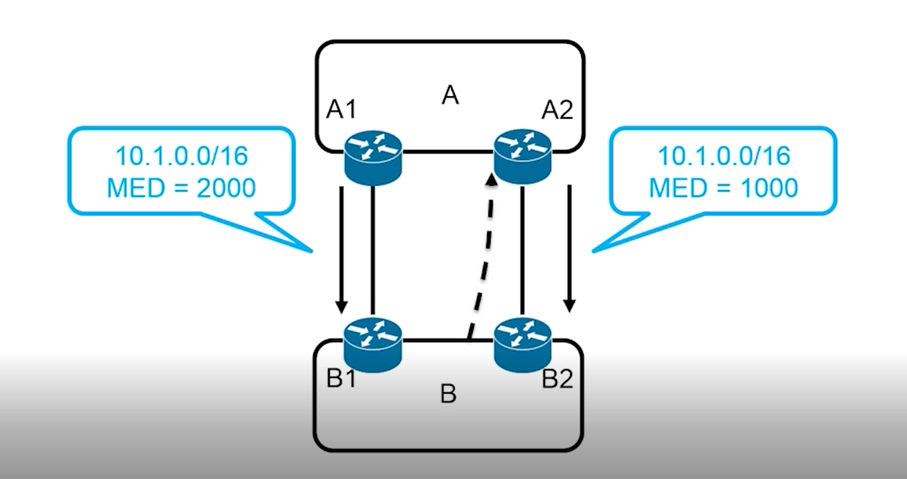
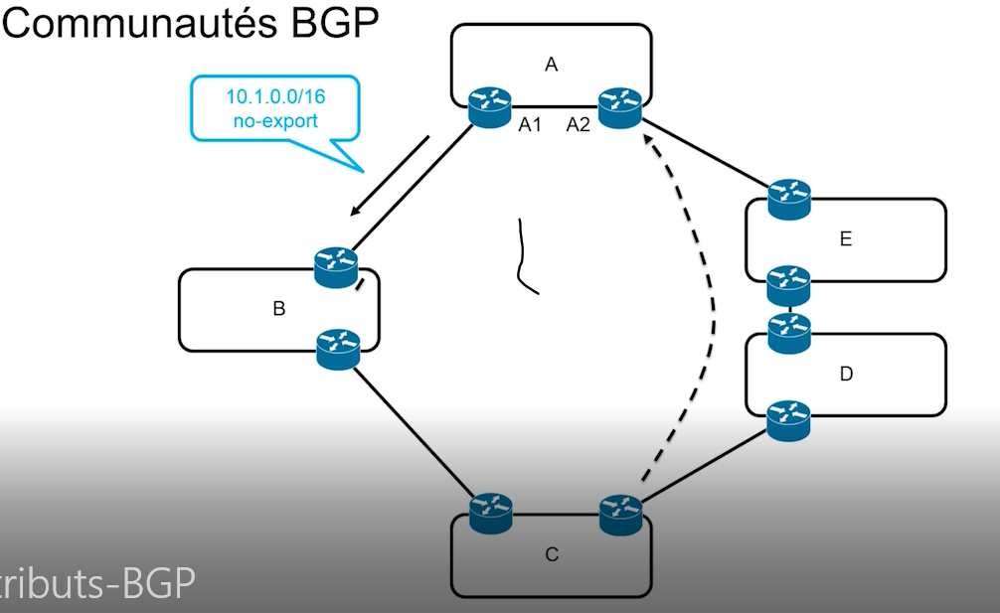

# BGP 

## §  Introduction :
Lorsque que notre paquet va sur internet, il est acheminé par des AS qui communiquent entre eux. Il existe un très grand nombre de chemin différents, car beaucoup sont reliés entre eux. Il est facile pour un paquet de changer de chemin en cas de panne d'un AS 
Border Gateway Protocole (BGP ) est le seul protocole de routage externe déployé sur internet. 
BGP est utile dans le cas de la multi-domiciliation, c'est le fait qu'un système autonome (AS) possède plusieurs Fournisseurs.
Il est utilisé pour les accès VPN 
 
Le protocole bgp appartient à la couche applicative, s'apppuie sur le protocole TCP et permet d'éviter la fragmentation, retransmission et le séquencement.
 

Un système autonome (AS) est un très grand réseau, ou groupe de réseaux, ayant une politique de routage interne cohérente. Chaque AS se voit attribuer un ASN unique (donné par l'IANA), qui est un numéro permettant d'identifier l'AS. 

## Comment son relié les AS 

Il existe plusieurs manières pour faire voyager les paquets entre plusieurs AS. 
    -  Le TRANSIT , faire payer les paquets  
    -  Le PEERING , accord bénéfique pour ne pas faire payer les paquets 

### Voici un exemple avec 4 AS 

Dans cette situation, C paye les paquets vers A, et D vers B. Alors que A et B sont en accord pour se transmettre mutuellement les paquets gratuitement. 
Le peering peut être renegocié et peut devenir payant en cas de transmission trop importante de paquet.

Je vais montrer un exemple qui permettra de comprendre plus simplement les accords qu'il peut y avoir.

On a :  
    - **E** et **D** en accord **TRANSIT**  
    - **C** et **B** en accord **TRANSIT**  
    - **B** et **A** en accord **TRANSIT**  
    - **D** et **B** en accord **PEERING** 

Dans cette situation, B et D peuvent communiquer entre eux. Mais lorsque B transmet les préfixs à A, il ne doit pas communiquer le préfix de D, ni celui de E. 
Sinon B payera l'accord de transit pour E et D alors qu'il sont en peering.

Il est possible de **renegocier l'accord de peering** pour **B** et **D** et de placer un lien de transit entre **D**  et **C**. 

Dans ce cas B peut choisir entre le **transit payant de C vers B** ou le **peering de D vers B** . Avec cette configuration, E pourra proposer son préfix à D et founir et B qui le donnera au fournisseur.

## § Les session BGP 
 
Pour communiquer entre eux les routeurs établissent des **sessions BGP**.
 
Il exsite 2 types de sessions BGP  
    - iBGP : Session interne d'un AS 
    - eBGP : Session externe d'un AS

### Exemple des sessions entre 4 AS (A,B,C et D) :

##  § Les messages BGP : 
    - OPEN ouvrir la session 
    - KEEPALIE garder la session
    - NOTIFICATION fermer la session
    - UPDATE mise à jours de la liste des prefixs et des attributs 
 

### Exemple d'une connexion BGP
Connexion TCP sur le port serveur 179.

## § Les attributs BGP 

Il existe plusieurs propriètés contenues dans les messages BGP : 
 
    - AS PATH : détection des boucles, choix du  
    - NEXTHOP :  
    - LOCAL PREF (Préférence locale ):Priorité au routeur avec une préférence locale la plus hautes. 
    - MED (Multi exit Discriminator): controler la route , priorité au MED le plus faible. 
    - Origin /
        Capture attribut  
    - COMMUNITIES: Simplifier les configurations (type de client, region géographique ou type d'échange)

 ### AS PATH
  

 
Pour communiquer avec C, A fournit sont AS_PATH qui montre à C qu'il doit passer par B pour joindre A. 
Plus il y a d'AS traversés, plus L'AS_PATH est long. Si un routeur détecte sa propre AS dans un chemin, il ignore ce chemin pour éviter les boucles.
 
Lorsque l'AS reçoie 2 chemins il est en mesure de choisir connaitre uniquement le nombre d'AS traversé.
 

 ### NEXTHOP 
  
 Le NEXTHOP permet de savoir quel est le routeur précédent qui a envoyé le paquet, et permis de remonter à la source. Pour qu'un routeur joigne un nouveau routeur dans un autre AS il existe 2 solutions :
    - annoncer l'addresse initial dans le protocole du routage interne de la seconde AS 
    - configurer le premier routeur d'entrée de la seconde AS pour mettre son addresse IP dans l'attribut NEXTHOP IBG.
 
 

 ### LOCAL PREF 
 
L'attribut LOCAL PREF permet d'indiquer le routeur de sortie avec IBGP (interne à une AS).Le routeur avec un LOCAL_PREF plus fort aura le chemin prioritaire.
On assigne à chaque routeur de sortie une préférence locale, qui permet de désigner le routeur qui sera prioritaire
 
 

 ### MED 
 

 L'attribut MED est utilisé principalement plusieurs interconnexions entre AS.
Le préfix qui aura fourni l'attribut MED le plus faible, sera prioritaire.
 
Dans ce schèma, l'attribut MED, transmis par A2 (IBGP), est prioritaire car il est plus faible. Donc B2 sera le routeur qui permettra à l'AS B de communiquer.
 

 

### ORIGIN 
Obligatoire :

        0 = interne au système qui a généré l'information
        1 = externe au sytème qui à généré l'information 
        2 = incomplète redistribution venant d'un routage statique ou dynamique 
Dans BGP une annoce avec l'origine 0 est préférée à 1, qui est elle même préférée à 2.

 ### COMMUNITIES

L'attribut communauté permet de simplifier la configuration des routeurs.
Cet attribut permet de déclarer des communautés en fonction des types de liens (Peering ou transit)entre les AS.
Exemple :
 
En déclarant un chemin en :
        
        no-export (Communauté existante)

On peut bloquer l'accès eBGP du côté de B, et forcer C a utiliser

## § Les critères du processus séléction 

Dans l'ordre, nous retrouvons le LOCAL_PREF (plus haut) 
L'AS_PATH (nombre de saut), l'ORIGIN (0,1,2),puis le MED (plus faible). 
Le type de session iBGP ou eBGP. 
Le chemin en eBGP(externe est préféré pour economiser la puissance de chaque AS). 
Le cout de routage interne (Exemple : Bande passante (OSFP)ou saut (RIP)) et pour finir l'id le plus faible dans l'attribut NEXT_HOP.

## Conclusion sur BGP 

BGP  est un protocole de routage utilisé pour connecter les différents réseaux qui composent Internet. Il est utilisé pour échanger des informations de routage entre les routeurs des différents opérateurs de réseau qui connectent les différents sous-réseaux qui composent Internet. Il permet aux routeurs de déterminer les chemins les plus efficaces pour acheminer les paquets de données à destination. Il est utilisé pour connecter les différents sous-réseaux qui composent Internet en utilisant des protocoles de routage intérieur tels que OSPF ou RIP . BGP permet également de gérer les conflits de routage et les erreurs de configuration. BGP permet la connectivité globale et assure la stabilité de l'Internet en s'adaptant aux changements de topologie.
